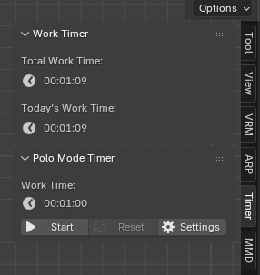
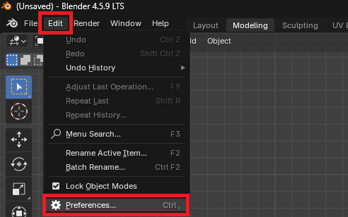
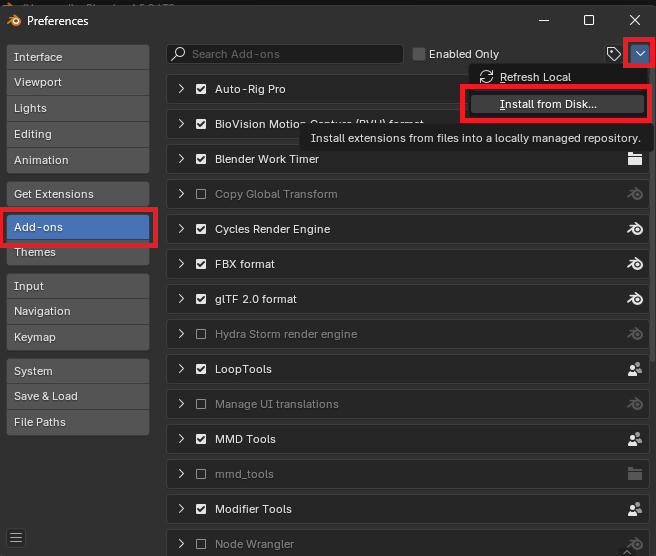
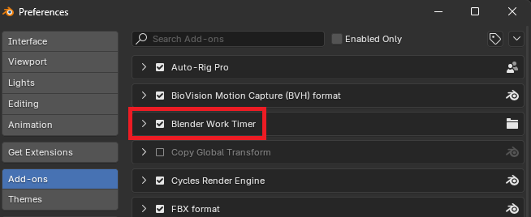
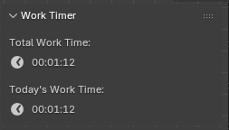
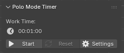

# Blender Work Timer
Blender 4.5.x LTS용 작업 시간 추적 애드온

> **[ 목적 ]**
> 이 애드온은 매일 Blender에서 보낸 시간을 시각화하여 **동기를 유지**하도록 돕기 위해 설계되었습니다. 또한 특정 작업(예: 모델링)에 너무 많은 시간을 소비하고 있는지 객관적으로 추적하여 **과로를 방지**하는 데 도움이 됩니다.

## 설치 방법 (How to Install)

1. 최신 **[Releases 페이지](https://github.com/HasciiCode/BlenderWorkTimer-Release/releases/latest)**에서 `BlenderWorkTimer.zip`을 다운로드합니다. (*zip 파일의 압축을 풀지 마십시오.*)
2. Blender를 열고 상단 메뉴에서 `편집 (Edit)` > `환경 설정 (Preferences)`으로 이동합니다.

3. 왼쪽 메뉴에서 `애드온 (Add-ons)`을 선택합니다.
4. 우측 상단의 `설치... (Install...)` 버튼을 클릭하고 다운로드한 `BlenderWorkTimer.zip`을 선택합니다.

5. 목록에 나타난 "System: Blender Work Timer" 옆의 체크박스를 선택하여 활성화합니다.

---

## 사용 방법 (Usage)

1. 3D 뷰포트에서 `N` 키를 눌러 사이드바를 엽니다.
2. **Timer** 탭을 클릭하여 추적 패널을 봅니다.
3. 작업을 시작하면 타이머가 자동으로 계산을 시작합니다.
4. 뽀모도로 모드(Polo Mode)를 사용하려면 "Polo Mode Timer" 섹션에서 Start 버튼을 클릭하세요.

---

## 주요 기능 (Features)

### 1. 실시간 작업 추적
Blender에서의 실제 작업 시간을 자동으로 추적하여 사이드바에 표시합니다.
- **유휴 상태 감지**: 2분 동안 마우스나 키보드 활동이 감지되지 않으면 타이머가 자동으로 일시 중지되어 실제 작업 시간만 기록되도록 합니다.
- **오늘 및 총 시간**: 해당 날짜의 작업 시간과 프로젝트의 총 누적 시간을 즉시 확인할 수 있습니다.

### 2. 뽀모도로 모드 (Pomodoro Timer)
Blender를 벗어나지 않고도 깊은 집중을 유지할 수 있도록 돕는 뽀모도로 기법 기반의 시간 관리 기능입니다.

> **[ 뽀모도로 모드란? (Pomodoro Technique) ]**
> 이 기법은 뇌의 피로를 막고 장기간 높은 생산성을 유지하기 위해 "짧은 집중 작업"과 "짧은 휴식"을 번갈아 하는 방법입니다.
> 전통적인 규칙은 "25분 작업 + 5분 휴식"이지만, 본인의 집중력에 맞춰 자유롭게 사용자 정의(예: 50분 + 10분)할 수 있습니다.

- **안정적인 알림**: 휴식을 취하거나 작업으로 돌아갈 시간이 되면 팝업 화면으로 알려주어 명확한 리듬을 만듭니다.
- **사용자 정의 가능**: 작업 세션과 휴식의 길이를 자유롭게 조정할 수 있습니다.

---

## 참고 사항 (Notes)
- 이 애드온은 `.blend` 파일을 저장할 때 동일한 디렉토리에 시간 데이터를 포함하는 숨김 폴더를 생성합니다.
- 동일한 `.blend` 파일을 여러 Blender 인스턴스에서 동시에 열더라도 데이터 충돌이 발생하지 않도록 설계되었습니다.
